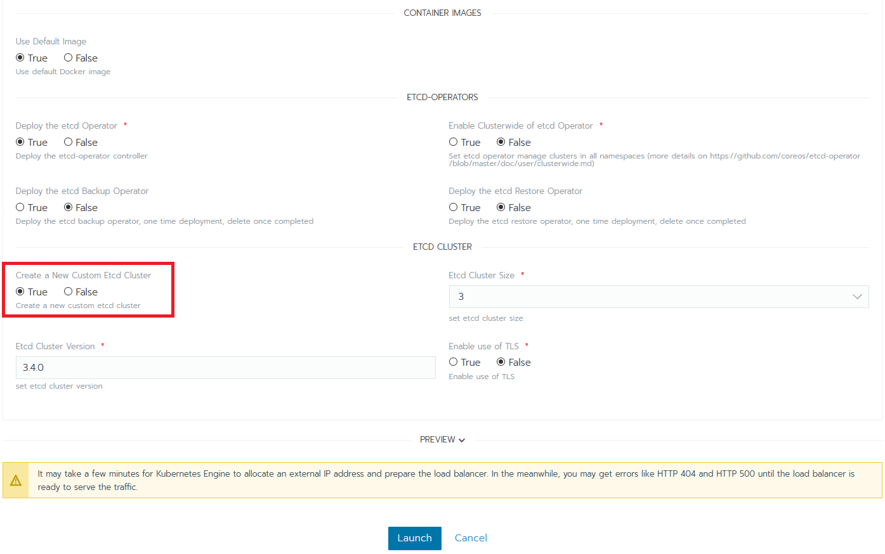
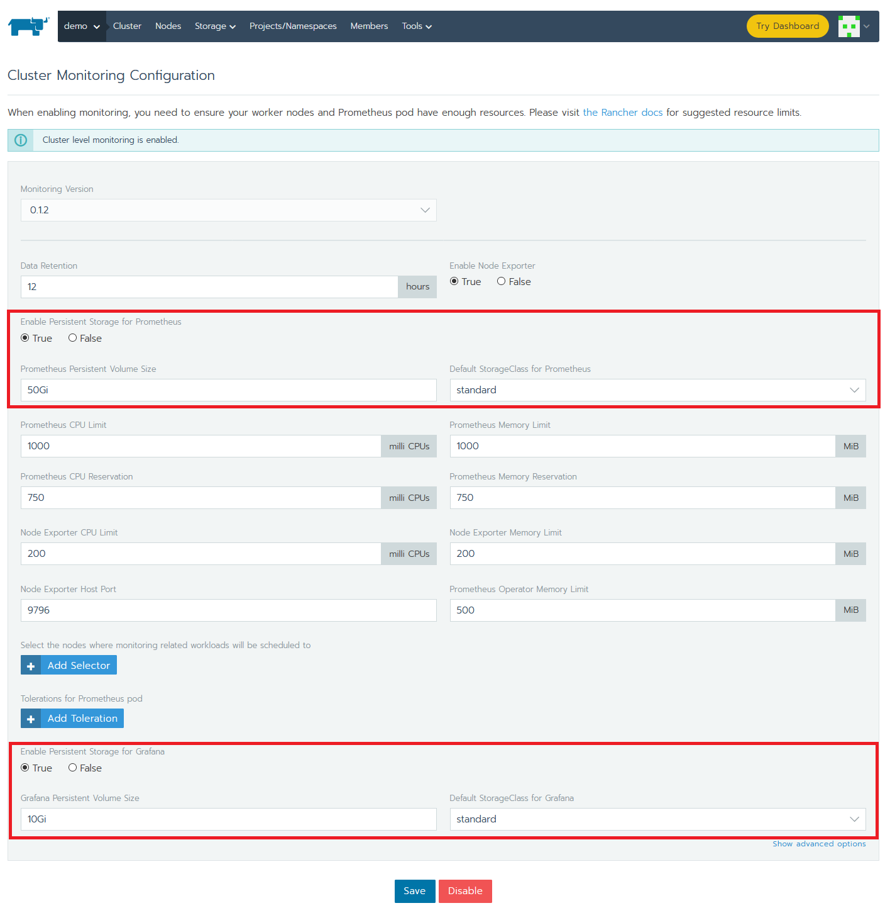
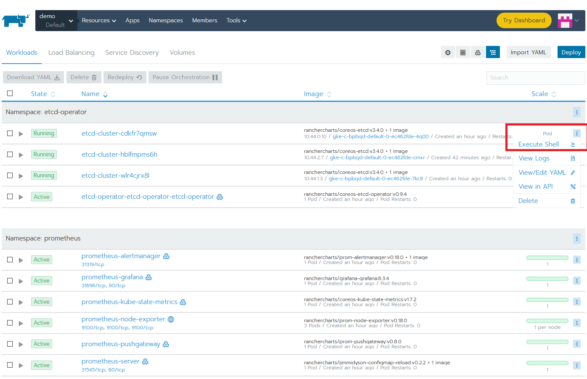
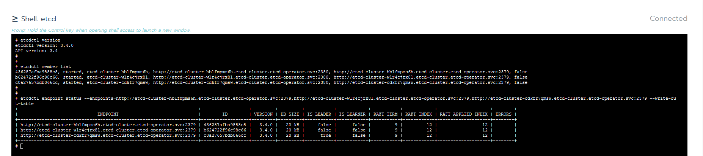
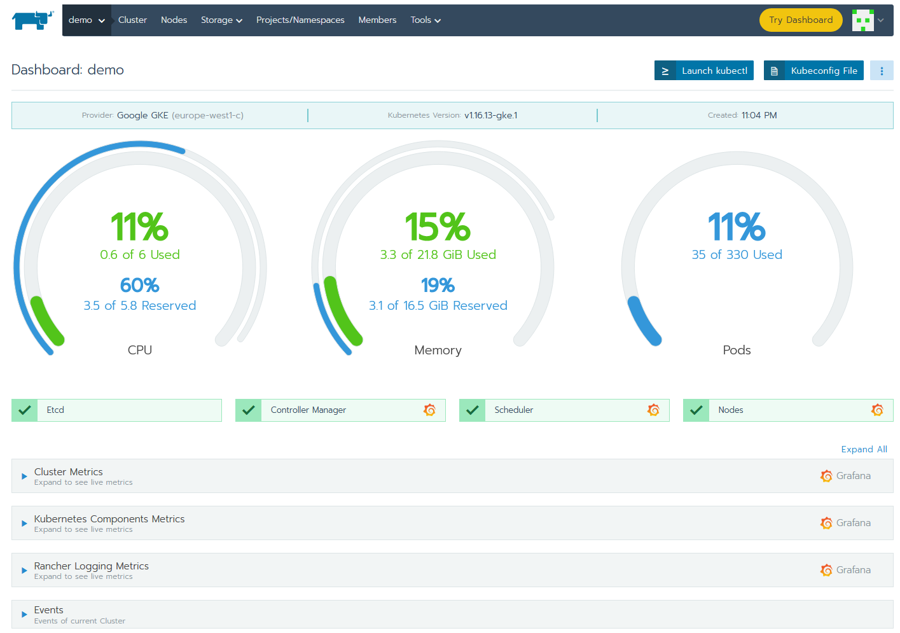
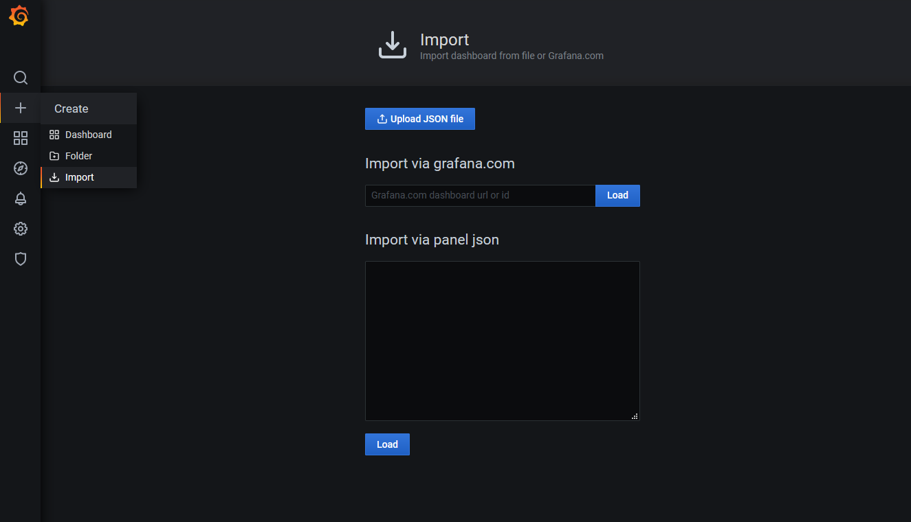
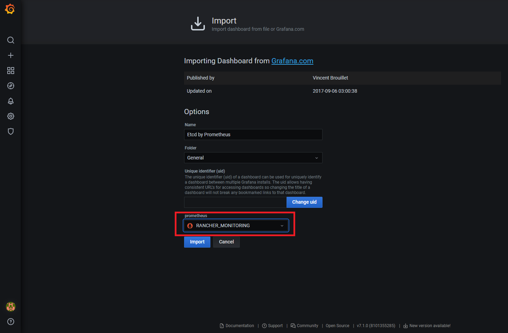
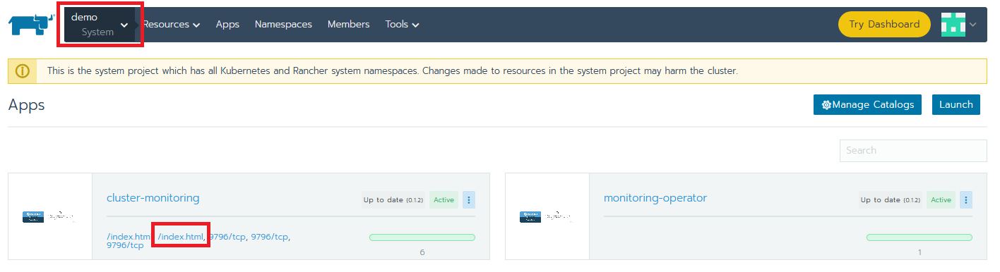
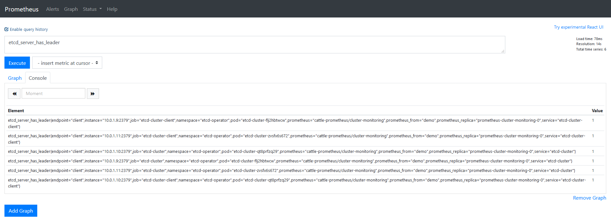
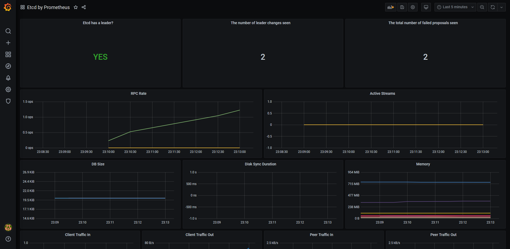

# Etcd Monitoring with Prometheus and Grafana 
### Introduction

This article is a follow up to [What Is Etcd and How Do You Set Up an Etcd Cluster](https://rancher.com/blog/2019/2019-01-29-what-is-etcd/). In this article, we will install an Etcd cluster and configure monitoring using Prometheus and Grafana, all with the help of Rancher.

We will see how easy it is to accomplish this without the need of dependencies, as we can take full advantage of Rancher's App Catalog.
We won't need:
- a dedicated box configured to run kubectl pointing to Kubernetes cluster
- knowledge of using `kubectl`,  as we can do everything using Rancher's UI
- Helm binary installed/configured 

## Prerequisites for the Demo
You will need:
- A Google Cloud Platform account (the free tier is more than enough). Any other cloud should also work.
- Rancher v2.4.7 (latest version at time of publication).
- A Kubernetes cluster running on Google Kubernetes Engine version 1.16.13-gke.1. (Running EKS or AKS should also work).

### Start a Rancher Instance

To begin, start your Rancher instance. Follow this intuitive [quick start guide](https://rancher.com/quick-start/).

### Deploy a GKE Cluster with Rancher

Use Rancher to set up and configure a Kubernetes cluster. You can find documentation [here](https://rancher.com/docs/rancher/v2.x/en/cluster-provisioning/).

### Deploy Etcd, Prometheus and Grafana

To install all this software, we will take advantage of Rancher's catalog. The catalog is a collection of Helm charts that make it easy to repeatedly deploy applications.

As soon as our cluster is up and running, let's select the **Default** project created for it and in Apps tab, click the Launch button.

The first app we will install is `etcd-operator`. Leave all the defaults it pre-populates and make sure you the etcd cluster creation too (for the simplicity of the demo we've unchecked the installation of `etcd Backup Operator` and `etcd Restore Operator`).

The operator's role is to observe, analyze and act. It uses the Kubernetes API to observe the current cluster state. If there are any differences between the running state and the desired one, it finds and fixes them.

For example, let's say that we are running an Etcd cluster with three members. If something happens and one member is down, the Operator observes this. It makes a diff <!--- is diff supposed to be in code font? --> against the desired state and because of the difference it recovers the missing member. Once again, we have a healthy cluster with no human intervention.



To install Prometheus and Grafana, activate the integrated Cluster Monitoring support in Rancher. From the Global view, navigate to the cluster that you want to configure, select Tools -> Monitoring to enable it. In order to allow changes to Grafana to persist, make sure to enable persistent storage for Grafana and Prometheus. If you don't have any persistent storage set up, have a look at [Longhorn](https://longhorn.io/), a cloud-native distributed block storage for Kubernetes.



While everything is installing, you can explore few tabs. Check the progress of the Workloads (Pods, Deployments, DaemonSet) or the Services created.

Let's connect to an etcd Pod in order to play with few basic etcdctl commands (more details on this in the previous article). Choose a Pod and click its vertical ellipsis (3 vertical dots) menu button and then Execute Shell.





### Configuring Prometheus and Grafana

One of the best and easiest ways to monitor an Etcd cluster is using Prometheus and Grafana. 
Let's log in to Grafana. To access it just click on any Grafana icon from cluster overview.



Grafana is already pre-configured to with Prometheus as a datasource and contains several dashboards visualizing the state of your cluster.

To add a dashboard for etcd, log into Grafana. The default username and password are both "admin" (at first login you will be prompted to change this).
Then import the default etcd dashboard template using the id `3070`. Hit load and as it loads directly, the only thing that remains is to select the Prometheus data source.





We've successfully imported the dashboard and we can see all sort of graphs, but there is no data display. Why? We have Prometheus running and Grafana is integrated with it. The problem is that we didn't tell Prometheus to scrape relevant targets related to our etcd cluster.

Let's go back to Rancher and fix this. Go to the System project and click on "Import YAML" under the Resources tab. Then import the following resource into the `cattle-prometheus` namespace.

```yaml
apiVersion: monitoring.coreos.com/v1
kind: ServiceMonitor
metadata:
  labels:
    source: rancher-monitoring
  name: etcd
  namespace: cattle-prometheus
spec:
  endpoints:
  - port: client
  namespaceSelector:
    matchNames:
    - etcd-operator
  selector:
    matchLabels:
      app: etcd
```

How do we know that our new configuration is valid and Prometheus is doing its job? To check, go to the Apps tab of the System project and click on the second `/index.html` link in the `cluster-monitoring` app. 



This will open the Prometheus web UI. There, go to Graphs and manually execute some queries, if there is data then we're all set.



The last thing we need to do is to check Grafana and see that we have graphs with relevant data.



### Tear down the app and the clusters

To clean up the resources that we used in this article we just need to go in Global, select our cluster and hit delete.
By doing this everything will be removed except the persistent storage created for Prometheus. We will need to take care of this from our cloud provider console.

Of course we can perform the cleanup from Rancher only, but there are slightly different steps:
- disable monitoring: from the Global view, navigate to the cluster, select Tools, Monitoring and hit disable button.
- remove the persistent storage: from System Project, Resources, Workloads, Volumes
- delete the cluster: in Gloval view select the cluster and delete it

### Conclusion

In this demo, we saw how to use Rancher to install install Etcd (using etcd-operator), Prometheus and Grafana. All of the integration is out of the box:  we needed only add a few bits to get everything configured. Rancher also provides all the visibility needed, in terms of troubleshooting, if necessary.
 
