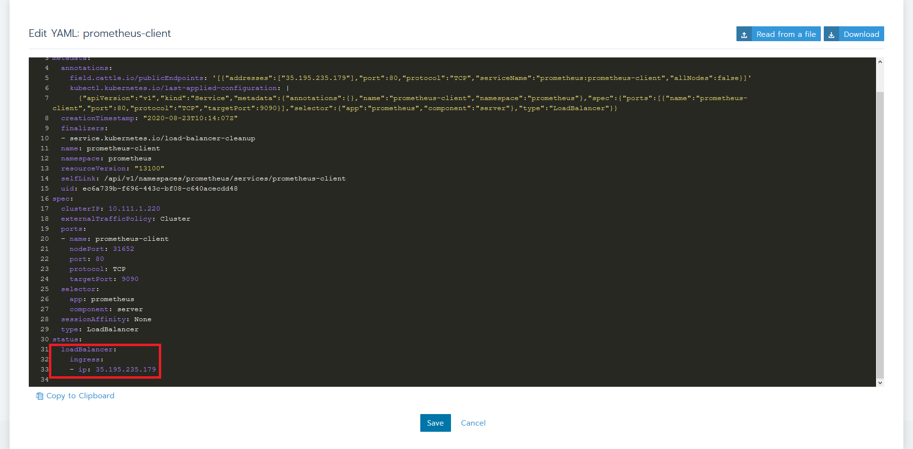
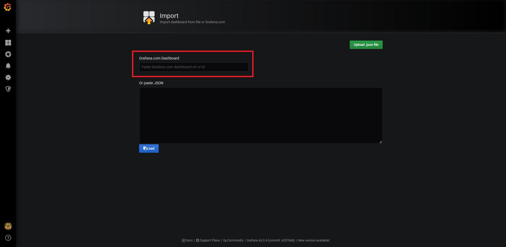
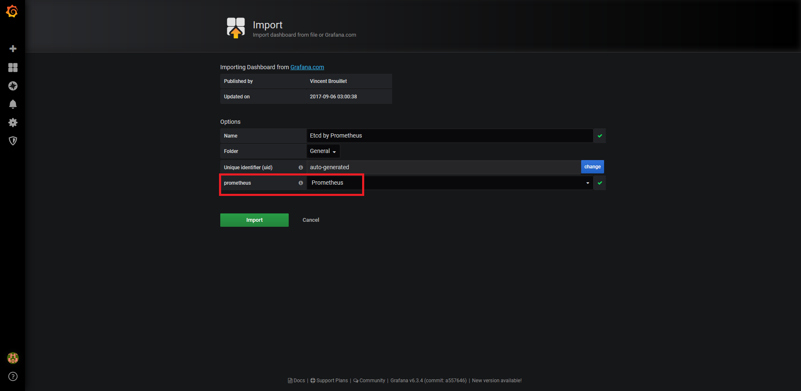

### Introduction

This article is a follow up to [What Is Etcd and How Do You Set Up an Etcd Cluster](https://rancher.com/blog/2019/2019-01-29-what-is-etcd/). In this chapter we will be going directly to installing an Etcd cluster, followed up by configuring monitoring using Prometheus and Grafana, all with the help of Rancher.

We will see how easy it is to accomplish this without the need of using all kind of dependencies, as we can take fully advantage of Rancher's Apps. We won't need:
- dedicated box configured to run kubectl pointing to Kubernetes cluster
- knowledge using `kubectl` as we can do everything using Rancher's UI
- helm binary installed/configured 

## Prerequisites for the Demo

- A Google Cloud Platform account (the free tier provided is more than enough). Any other cloud should work the same.
- Rancher v2.4.5 (latest version at time of publication).
- A Kubernetes cluster running on Google Kubernetes Engine version 1.16.13-gke.1. (Running EKS or AKS should be the same).

### Starting a Rancher Instance

To begin, start your Rancher instance. There is a very intuitive getting started [guide](https://rancher.com/quick-start/) for Rancher that you can follow for this purpose.

### Using Rancher to Deploy a GKE cluster

Use Rancher to set up and configure a Kubernetes cluster. Documentation can be found [here](https://rancher.com/docs/rancher/v2.x/en/cluster-provisioning/)

### Deploying Etcd, Prometheus and Grafana

To install all this software, we will take advantage of Rancher's catalog. The catalog is a collection of Helm charts that make it easy to repeatedly deploy applications.

As soon as our cluster is up and running, let's select the **Default** project created for it and in Apps tab and click the Launch button.

First app we will be installing is `etcd-operator`. Leave all the defaults it pre-populates and make sure you enable the etcd cluster creation too (for the simplicity of the demo we've unchecked the installation of `etcd Backup Operator` and `etcd Restore Operator`).

The Operator's role is to observe analyze and act. It is using the Kubernetes API to observe the current cluster state. If there are any differences between the running state and the desired one, it finds them and lastly fixes them.

As an example, let's say that we are running an Etcd cluster with 3 members. If something happens and one member is down, the Operator observes this. It makes a diff against the desired state and because of the difference it acts to recover the one missing member. Now we have again a healthy cluster with no human intervention.


Let's proceed now installing Prometheus software. Again leave all the defaults suggested and just make sure to install Grafana too (set up an Admin password at this point).


While everything gets done you can explore few tabs. You can check the progress of the Workloads (Pods, Deployments, DaemonSet) or the Services created.

Let's connect to an etcd Pod in order to play with few basic etcdctl commands (more details on this in the previous article). Choose a Pod and click its vertical ellipsis (3 vertical dots) menu button and then Execute Shell.


### Configuring Prometheus and Grafana

One of the best and easiest solutions to monitor Etcd cluster is using Prometheus and Grafana. While these were installed with just few clicks from Rancher's App they still need some proper configuration/integration. 

First let's figure out the access. We will create two services, so we can access the services externally. 
For this we need to go Load Balancer tab an import two YAML files, one for each service. Hit Import YAML button and paste the configuration.

- for Prometheus:

```yaml
---
apiVersion: v1
kind: Service
metadata:
  name: prometheus-client
spec:
  type: LoadBalancer
  ports:
  - name: prometheus-client
    port: 80
    protocol: TCP
    targetPort: 9090
  selector:
    app: prometheus
    component: server
```

- for Grafana:

```yaml
---
apiVersion: v1
kind: Service
metadata:
  name: grafana-client
spec:
  type: LoadBalancer
  ports:
  - name: grafana-client
    port: 80
    protocol: TCP
    targetPort: 3000
  selector:
    app: grafana
```


As soon as they become active, click on their vertical ellipsis (3 vertical dots) and select View/Edit YAML and look for the external IP associated. It should be something like this:



Write them down, as we will jump from one window to another.

Let's login into Grafana (use here the admin password used while installing the app). In the Home Dashboard page the first thing we need to do is to add a data source. Grafana has built-in Prometheus support, so we just need to add Prometheus data source using the public IP we previously created for this.


Then import the default etcd dashboard template, use the id `3070` for this. As it loads directly, the only thing which remains is to select Prometheus data source previously configured.




Dashboard has been successfully imported, we can see all sort of graphs, but there is no data display. Why?
We have Prometheus running, we have Grafana integrated with it, problem is that we didn't tell Prometheus to scrape relevant targets related to our etcd cluster.

Let's go back to Rancher and fix this. Under Resources tab, we can find the prometheus-server Config Map, we will need to edit this.
Following lines need to be added, telling Prometheus to look for etcd Pods. We will be using `kubernetes_sd_configs` Kubernetes Service Discovery as provided by Prometheus.

```yaml
- job_name: 'demo'
  kubernetes_sd_configs:
  - role: pod
  relabel_configs:
  - source_labels:
    - __meta_kubernetes_pod_label_app
    regex: etcd
    action: keep
```

How do we know that our new configuration is valid and Prometheus is doing what it is supposed to?

Let's paste the config and make a small typo (see the extra "s" in kubernetes_sd_configss).


Let's check Prometheus logs. For this we need to go in Resources, Workloads and look for prometheus-server. Click its vertical ellipsis (3 vertical dots) menu button
and View Logs.


```bash
level=error ts=2020-08-23T10:22:42.694Z caller=main.go:582 msg="Error reloading config" err="couldn't load configuration (--config.file=\"/etc/config/prometheus.yml\"): parsing YAML file /etc/config/prometheus.yml: yaml: unmarshal errors:\n  line 11: field kubernetes_sd_configss not found in type config.plain"
```

The error message is pretty clear, we have a bad config, which we need to fix. So, we just need to go back, edit properly the config (in this example just remove the extra "s" we added on purpose) and click Save. Now the logs should look like this:


If you are not used to logs that much, you can check the same from Prometheus server. Access its external IP address and here you can see if the configuration reload was successful or not (below screenshot has the bad config loaded).


Last thing to do is to check now Grafana and see that we have graphs with relevant data.


### Conclusion

To wrap up this demo, we saw how Rancher helps us installing Etcd (using etcd-operator), Prometheus and Grafana. All the integration is out of the box, there are only few bits needed to be added to get everything configured. Also we get from Rancher all the visibility needed, in terms of troubleshooting, if necessary.
